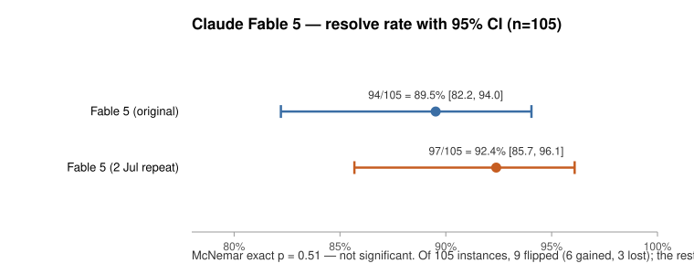

# Claude Fable 5 — repeat run comparison

**Question:** has Claude Fable 5 changed since the first run? The model was
re-run on the identical frozen instance sets, and this compares the two.

**Verdict: no detectable change.** The repeat resolved 3 more instances out of
105 (94 → 97), while cost, steps and token spend land almost exactly on the
first run. A 3-instance gap on a single pass sits inside run-to-run noise — one
pass is n=1 per cell and cannot separate "better" from "got lucky." Firming this
up beyond "looks unchanged" would need repeats, not one more run.

## The two runs

| _ | Fable 5 (original) | Fable 5 (2 Jul repeat) |
|---|---|---|
| **Standard: 60 problems (<1 h human effort)** | | |
| Resolved (out of 60) | 55 | 57 |
| Resolved % | 92% | 95% |
| Total cost | $30.68 | $28.51 |
| $ / resolved | $0.56 | $0.50 |
| Steps | 657 | 647 |
| Output tokens | 309k | 282k |
| Thinking (output) | 159k | 135k |
| Input tokens | 6.80M | 6.21M |
| - non-cached | 1.3k | 1.3k |
| - cache read | 6.07M | 5.50M |
| - cache write | 731k | 711k |
| Wall-clock (12-way parallel) | 2.0 h | 1.6 h |
| **Hard: 45 problems (1+ h human effort)** | | |
| Resolved (out of 45) | 39 | 40 |
| Resolved % | 87% | 89% |
| Total cost | $52.85 | $54.79 |
| $ / resolved | $1.36 | $1.37 |
| Steps | 743 | 796 |
| Output tokens | 536k | 525k |
| Thinking (output) | 308k | 283k |
| Input tokens | 12.84M | 15.20M |
| - non-cached | 1.5k | 2.0k |
| - cache read | 11.69M | 14.04M |
| - cache write | 1.15M | 1.16M |
| Wall-clock (12-way parallel) | 2.4 h | 2.5 h |
| **Combined: 105 problems** | | |
| Resolved (out of 105) | 94 | 97 |
| Resolved % | 90% | 92% |
| Total cost | $83.53 | $83.30 |
| $ / resolved | $0.89 | $0.86 |
| Steps | 1,400 | 1,443 |
| Output tokens | 845k | 807k |
| Thinking (output) | 468k | 418k |
| Input tokens | 19.64M | 21.41M |
| - non-cached | 2.8k | 3.3k |
| - cache read | 17.76M | 19.54M |
| - cache write | 1.88M | 1.87M |
| Wall-clock (12-way parallel) | 4.4 h | 4.1 h |

## What was held identical

- The frozen instance sets (60 standard + 45 hard), the scaffold, system prompt,
  `swebench-local.yaml` + adaptive thinking, 3 workers — a faithful re-run.

## Significance

The two runs' 95% confidence intervals overlap heavily and the paired McNemar
test is not significant (p = 0.51): the 94 → 97 difference is within run-to-run
noise, not a real change.

